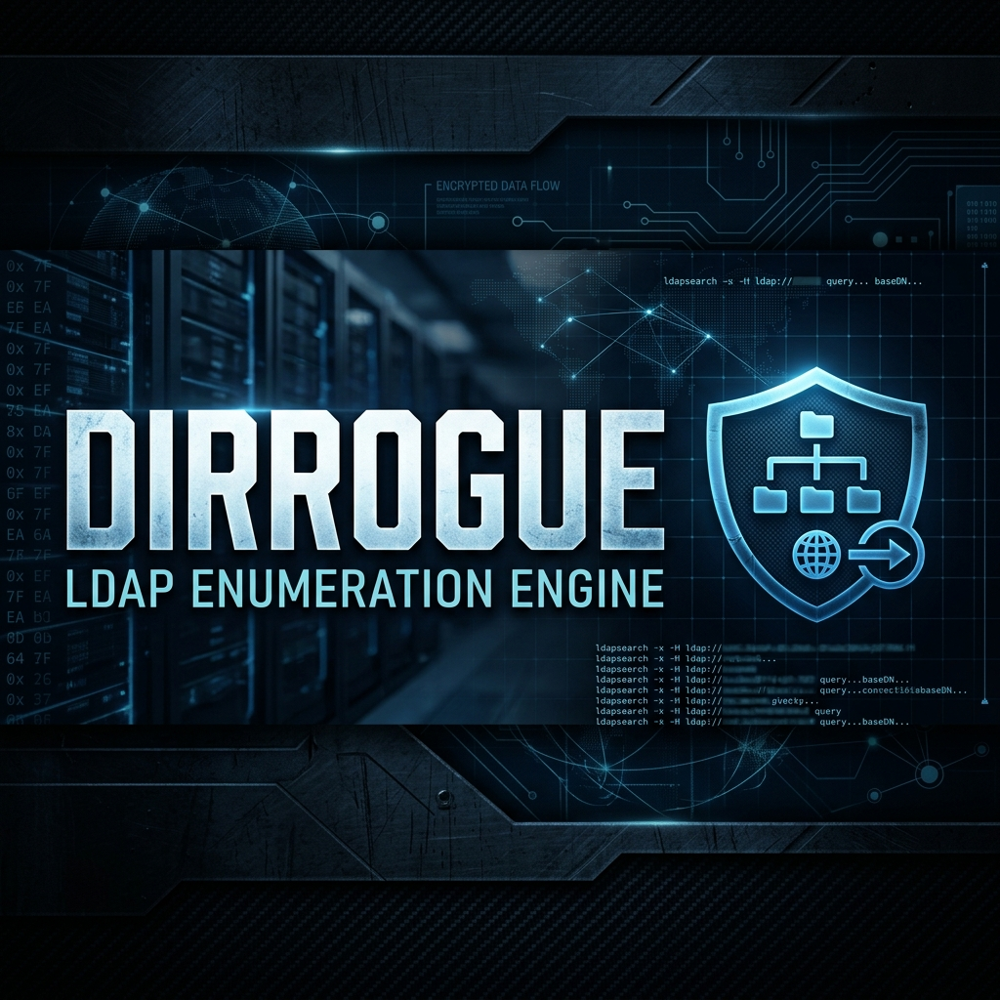

<p align="center">
  
</p>

<p align="center">
  
  
  
  
</p>

<h1 align="center">DirRogue</h1>

<p align="center">
  <b>DirRogue</b> is a high-fidelity, professional LDAP injection and enumeration engine designed for autonomous vulnerability research. It leverages advanced behavioral oracles and polymorphic mutation chains to identify deep-seated directory service flaws while maintaining full operational stealth.
</p>

---

## Tactical Overview

DirRogue addresses the complexity of modern LDAP-backed web applications by implementing a multi-signal detection pipeline. Unlike traditional scanners, DirRogue correlates timing differentials, boolean response shifts, and out-of-band signals to build a deterministic proof of vulnerability.

### Key Capabilities

- **Autonomous Parameter Discovery**: Intelligent crawler that identifies hidden input vectors, including JSON keys, form fields, and URI fragments.
- **Polymorphic WAF Evasion**: Real-time mutation of injection strings to bypass signature-based and heuristic filtering layers.
- **Three-Stage Verification**: Automated proof-of-concept generation that confirms exploitability through differential analysis.
- **Directory Schema Fingerprinting**: Passive and active probing to identify backend directory types (Active Directory, OpenLDAP, 389 Directory Server).
- **Adaptive Rate Control**: Dynamic request throttling to ensure target stability and bypass rate-limiting defenses.

---

## Technical Specifications

DirRogue is structured as a modular tactical suite, allowing for granular control over the scanning lifecycle:

| Module | Functional Responsibility |
| :--- | :--- |
| **Engine** | Core orchestration of phase-based injection and state management. |
| **Discovery** | Surface area mapping and recursive parameter identification. |
| **Detection** | Multi-vector analysis pipeline (Timing, Boolean, Error, OOB). |
| **Extraction** | High-speed data exfiltration engine for blind LDAP enumeration. |
| **Intelligence** | Stateful memory system for payload optimization and WAF adaptation. |

---

## Operational Deployment

### Initial Setup

To deploy DirRogue in your environment, utilize the integrated professional installer:

```bash
git clone https://github.com/project-hellhound-org/DirRogue.git
cd DirRogue
chmod +x install.sh
./install.sh
```

### Standard Execution

Run a tactical scan against a target environment:

```bash
dirrogue https://target-app.internal --threads 10 --budget 1000
```

### Advanced Configuration

| Flag | Impact |
| :--- | :--- |
| --auth-url | Define a specific URL for authentication bypass testing. |
| --collab | Set an external collaborator host for OOB callback detection. |
| --force-scan | Bypass safety qualifications and scan all identified parameters. |
| --findings | Specify a custom filename for the tactical JSON findings report. |

---

## Detailed LDAP Content

### The Three-Step Verifier

DirRogue implements a proprietary verification method to ensure zero false positives:

1.  **Baseline Collection**: The engine establishes a behavior baseline for the target parameter.
2.  **Differential Injection**: Submits paired payloads designed to produce opposing logical results (TRUE vs FALSE).
3.  **Statistical Confirmation**: Analyzes response deltas using binomial distribution testing to confirm significance.

### Polymorphic Mutation

Payloads are dynamically wrapped in mutation chains including:
- Null-byte injection (%00)
- Character encoding variations
- Filter nesting and logical chaining
- Statistical metacharacter spraying

---

## Author & License

- **Author**: Abinav3ac
- **License**: Distributed under the GNU General Public License v3.0. See `LICENSE` for details.

---

<p align="center">
  <b>Project Hellhound Tactical Unit</b>
</p>
